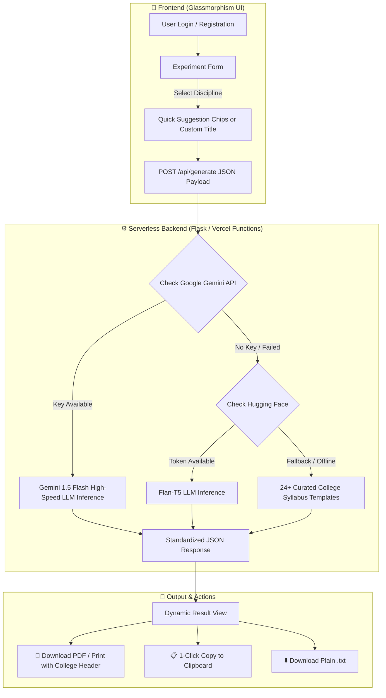

# 🤖 AI Lab Record Generator

<div align="center">

[](https://ranjithbrs.github.io/AI-Lab-Record-Generator/)
[](https://ai-lab-record-generator-two.vercel.app)
[](https://www.python.org/)
[](https://flask.palletsprojects.com/)
[](https://huggingface.co/)
[](LICENSE)

<br>

**Automated Technical Lab Record & Experiment Report Generator for Engineering & Science Students.**  
*Powered by Flask, Hugging Face LLM APIs, and Serverless Vercel Architecture with Offline Rule-Based Fallback.*

</div>

---

## 🌐 Live Application Links

- 🚀 **GitHub Pages Portal**: [ranjithbrs.github.io/AI-Lab-Record-Generator](https://ranjithbrs.github.io/AI-Lab-Record-Generator/)
- ⚡ **Vercel Serverless App**: [ai-lab-record-generator-two.vercel.app](https://ai-lab-record-generator-two.vercel.app)
- 📦 **GitHub Repository**: [github.com/ranjithbrs/AI-Lab-Record-Generator](https://github.com/ranjithbrs/AI-Lab-Record-Generator)

---

## 🎯 System Architecture & Generation Workflow



---

## ✨ Key Features

- 🎨 **Modern Dark Glassmorphism Design System** — Sleek translucent cards, smooth micro-animations, and mobile-friendly responsive forms.
- 🔐 **Authentication & Session Flow** — Dedicated Login & Register views with client-side session validation.
- 🧪 **Multi-Discipline Experiment Engine**:
  - **Computer Science & Programming Labs**: Generates *Aim, Algorithm, Source Code (C/C++/Java/Python), Sample Input/Output, and Result*.
  - **General Science Labs (Physics/Chemistry/Biology)**: Generates *Aim, Theory, Apparatus/Reagents, Step-by-Step Procedure, Tabular Observations, and Conclusion*.
- 🛡️ **Zero-Downtime Fallback Engine**: If cloud AI inference APIs experience latency or rate limits, an offline rule-based knowledge engine generates accurate academic experiment structures seamlessly.
- ⚡ **Instant Export Utilities**:
  - 📋 **Copy to Clipboard** with animated toast feedback.
  - 💾 **Download `.txt` File** formatted to meet academic lab report submission standards.

---

## 🔌 API Endpoint Specification

### 1. `POST /api/generate`
Generates a structured experiment lab record.

**Request Payload:**
```json
{
  "subject": "Computer Science",
  "topic": "Binary Search Algorithm",
  "language": "Python",
  "aim": "Write a Python program to implement binary search in a sorted array."
}
```

**Response Format:**
```json
{
  "status": "success",
  "data": {
    "aim": "To implement binary search algorithm in Python.",
    "algorithm": ["1. Start", "2. Find mid index...", "3. Compare element..."],
    "code": "def binary_search(arr, x):\n    low = 0\n    high = len(arr) - 1...",
    "output": "Element found at index 3",
    "result": "The program for binary search was successfully executed."
  }
}
```

---

## 📂 Project Structure

```text
AI-Lab-Record-Generator/
├── api/
│   └── index.py         # Vercel Serverless Function entry point
├── backend/
│   └── app.py           # Core Flask server & AI generation engine
├── public/              # Static Frontend Assets
│   ├── index.html       # Landing & Auth Entry
│   ├── login.html       # Login Interface
│   ├── register.html    # Student Registration
│   ├── form.html        # Experiment Input Form
│   ├── result.html      # Dynamic Output Display
│   ├── script.js        # Form Validation & API Call Handlers
│   └── style.css        # Glassmorphism Design System
├── requirements.txt     # Python Dependencies
├── vercel.json          # Serverless Route & Rewrite Configuration
└── README.md            # Comprehensive Documentation
```

---

## 🚀 Quick Start (Local Setup)

### 1. Clone the repository
```bash
git clone https://github.com/ranjithbrs/AI-Lab-Record-Generator.git
cd AI-Lab-Record-Generator
```

### 2. Set up virtual environment & install dependencies
```bash
python -m venv .venv
source .venv/bin/activate       # On Linux/macOS
# .venv\Scripts\activate        # On Windows

pip install -r requirements.txt
```

### 3. Run the Flask development server
```bash
python backend/app.py
```

### 4. Launch in Browser
Open `http://127.0.0.1:5000` or open `public/index.html` in your preferred web browser.

---

## 👨‍💻 Author

**Ranjith B**  
🎓 *B.Tech Computer Science & Business Systems (CSBS)*  
🏛️ *Nehru Institute of Engineering and Technology, Coimbatore*  

- 💼 **LinkedIn**: [linkedin.com/in/ranjith-b-csbs23](https://linkedin.com/in/ranjith-b-csbs23)  
- 🐙 **GitHub**: [github.com/ranjithbrs](https://github.com/ranjithbrs)  
- 🌐 **Portfolio**: [ranjithbrs.github.io/portfolio](https://ranjithbrs.github.io/portfolio/)  
- 📧 **Email**: ranjithb2k06@gmail.com  

---

## 📄 License

This project is licensed under the [MIT License](LICENSE).
